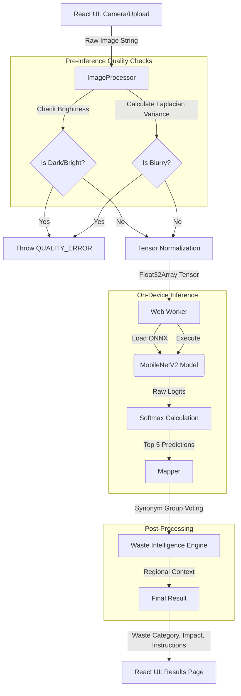

# EcoSort AI - Architecture

EcoSort AI is designed with a strict **Offline-First, Privacy-Preserving Architecture**. All complex computing—including image preprocessing and deep learning inference—happens securely on the client's device.

## 🏗️ High-Level Data Flow (The AI Pipeline)

## 🧠 AI Layer Details

The AI logic is decoupled from the UI, located in `src/ai/`:

1. **Preprocessing (`imageProcessor.ts`):**
   - Uses `OffscreenCanvas` to instantly resize the image to 224x224.
   - Calculates Brightness and Blur to prevent wasting battery on bad photos.
   - Normalizes RGB values to the standard `mean=[0.485, 0.456, 0.406]` format required by MobileNetV2.
2. **Inference Engine (`worker.ts`):**
   - Runs **ONNX Runtime Web** inside an isolated Web Worker.
   - Automatically attempts to use `WebGPU` for extreme acceleration, seamlessly falling back to `WASM` if the user's browser lacks GPU support.
3. **Postprocessing (`mapper.ts`):**
   - Converts the Top 5 raw ImageNet predictions into actionable Waste Categories using **Synonym Group Voting** (e.g. mapping "pop bottle", "water bottle", and "shampoo bottle" to "Plastic").

## 💾 Offline Storage & History

Data persistence is handled by **IndexedDB** using `dexie.js`, located in `src/offline/db.ts`.

- **WebP Downscaling:** To prevent quota exhaustion (QuotaExceededError), high-resolution images are dynamically downscaled to a heavily compressed **256x256 WebP (0.8 Quality)** thumbnail before saving.
- **Exporting:** Users can export their entire IndexedDB scan history locally as a CSV or JSON file without querying a backend server.

## ⚛️ UI & State Management

- **Framework:** React 19 + Vite 8
- **Styling:** Tailwind CSS v4 (with strict Dark Mode support)
- **State Management:** `zustand` is used for global preferences (Theme, Language, Regional Rules).
- **Routing & Suspense:** Heavy UI components (Scanner, History) are dynamically imported using React Lazy and Suspense to keep the initial JavaScript bundle as small as possible.
